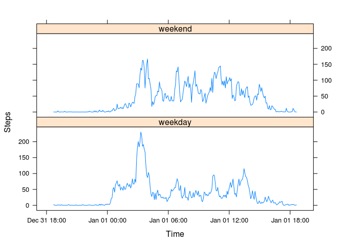

# Reproducible Research: Peer Assessment 1


## Loading and preprocessing the data

```r
library(dplyr)
```

```
## 
## Attaching package: 'dplyr'
## 
## The following object is masked from 'package:stats':
## 
##     filter
## 
## The following objects are masked from 'package:base':
## 
##     intersect, setdiff, setequal, union
```

```r
library(lubridate)
library(ggplot2)

## Read in the data, with a header row and no factors
activity <- read.csv("activity.csv", header=TRUE, stringsAsFactors=FALSE)

## Use lubridate to parse the date times, integer division of interval produces the hour,
## while the modulo 100 of interval produces the minutes.
activity$datetime <- parse_date_time(paste(activity$date, activity$interval %/% 100, 
                                           activity$interval %% 100), "Y-m-d H M")
activity$time <- parse_date_time(paste(activity$interval %/% 100, activity$interval %% 100), "H M")
```

## What is mean total number of steps taken per day?


```r
# For this part of the assignment, you can ignore the missing values in the dataset.
activityNA <- na.omit(activity)

  # Calculate the total number of steps taken per day
sumsteps <- summarize(group_by(activityNA, date), totsteps=sum(steps))

  # If you do not understand the difference between a histogram and a barplot, research the difference between
  # them. Make a histogram of the total number of steps taken each day
ggplot(sumsteps, aes(x=totsteps)) + 
  geom_histogram(fill="yellow", colour="black") + 
  ggtitle("Total Number of Steps per Day\nOct 1, 2012 - Nov 30, 2012") + 
  xlab("Steps per Day") + 
  ylab("Frequency")
```

 

```r
  # Calculate and report the mean and median of the total number of steps taken per day
mean(sumsteps$totsteps)
```

```
## [1] 10766.19
```

```r
median(sumsteps$totsteps)
```

```
## [1] 10765
```


## What is the average daily activity pattern?

```r
  # Make a time series plot (i.e. type = "l") of the 5-minute interval (x-axis) and the average number 
  # of steps taken, averaged across all days (y-axis)

avgsteps <- summarize(group_by(activityNA, time), avgsteps=mean(steps))

  # Function for formatting x-axis labels
time_formatter <- function(x){
  return(format(x, "%X"))
}

maxsteps <- format(avgsteps[head(order(avgsteps$avgsteps, decreasing=TRUE), 1),]$time, format="%X")

ggplot(avgsteps, aes(x=time, y=avgsteps)) +
  geom_line(col="darkred") + 
  ylab("Average Number of Steps") + 
  scale_x_datetime(name="Time", labels=time_formatter) + 
  ggtitle("Time Series Average of Number of Steps\n of the 5-Minute Intervals Averaged Across All Days") +
  annotate("text", 
           x=quantile(range(avgsteps$time), 0.6), 
           y=200, 
           label=paste("Max. Steps occurs at", maxsteps), 
           size=4, 
           col="darkgreen")
```

 

```r
  # Which 5-minute interval, on average across all the days in the dataset, 
  # contains the maximum number of steps?
print(paste("5-minute interval with the maximum average number of steps starts at:", maxsteps))
```

```
## [1] "5-minute interval with the maximum average number of steps starts at: 08:35:00 AM"
```

## Imputing missing values

```r
  # Calculate and report the total number of missing values in the dataset (i.e. the total number of 
  # rows with NAs)
print(paste("Number of rows with NAs", summary(activity$steps)[7]))
```

```
## [1] "Number of rows with NAs 2304"
```

```r
  # Devise a strategy for filling in all of the missing values in the dataset. The strategy does not 
  # need to be sophisticated. For example, you could use the mean/median for that day, or the mean 
  # for that 5-minute interval, etc.
```
To fill in the missing data points, assign the mean for that 5-minute interval

```r
  # Create a new dataset that is equal to the original dataset but with the missing data filled in.
activityFilledNA <- activity
for(i in 1:nrow(activity)){
  if(is.na(activityFilledNA[i,]$steps)){
    activityFilledNA[i,]$steps <- subset(avgsteps, time ==activityFilledNA[i,5])$avgsteps
  }
}

  # Make a histogram of the total number of steps taken each day and Calculate and report the mean 
  # and median total number of steps taken per day. Do these values differ from the estimates from 
  # the first part of the assignment? What is the impact of imputing missing data on the estimates 
  # of the total daily number of steps?
sumstepsFilledNA <- summarize(group_by(activityFilledNA, date), totsteps=sum(steps))

ggplot(sumstepsFilledNA, aes(x=totsteps)) + 
  geom_histogram(fill="orange", colour="black") + 
  ggtitle("Total Number of Steps per Day\nOct 1, 2012 - Nov 30, 2012 (Filled-in NAs)") + 
  xlab("Steps per Day") + 
  ylab("Frequency")
```

 

```r
  # Calculate and report the mean and median of the total number of steps taken per day
mean(sumstepsFilledNA$totsteps)
```

```
## [1] 10766.19
```

```r
median(sumstepsFilledNA$totsteps)
```

```
## [1] 10766.19
```

## Are there differences in activity patterns between weekdays and weekends?


```r
  # Calculate and report the total number of missing values in the dataset (i.e. the total number of 
  # rows with NAs)
print(paste("Number of rows with NAs", summary(activity$steps)[7]))
```

```
## [1] "Number of rows with NAs 2304"
```

```r
  # Devise a strategy for filling in all of the missing values in the dataset. The strategy does not 
  # need to be sophisticated. For example, you could use the mean/median for that day, or the mean 
  # for that 5-minute interval, etc.

  # Create a new dataset that is equal to the original dataset but with the missing data filled in.
activityFilledNA <- activity
summary(activityFilledNA)
```

```
##      steps            date              interval     
##  Min.   :  0.00   Length:17568       Min.   :   0.0  
##  1st Qu.:  0.00   Class :character   1st Qu.: 588.8  
##  Median :  0.00   Mode  :character   Median :1177.5  
##  Mean   : 37.38                      Mean   :1177.5  
##  3rd Qu.: 12.00                      3rd Qu.:1766.2  
##  Max.   :806.00                      Max.   :2355.0  
##  NA's   :2304                                        
##     datetime                        time                 
##  Min.   :2012-10-01 00:00:00   Min.   :0-01-01 00:00:00  
##  1st Qu.:2012-10-16 05:58:45   1st Qu.:0-01-01 05:58:45  
##  Median :2012-10-31 11:57:30   Median :0-01-01 11:57:30  
##  Mean   :2012-10-31 11:57:30   Mean   :0-01-01 11:57:30  
##  3rd Qu.:2012-11-15 17:56:15   3rd Qu.:0-01-01 17:56:15  
##  Max.   :2012-11-30 23:55:00   Max.   :0-01-01 23:55:00  
## 
```

```r
for(i in 1:nrow(activity)){
  if(is.na(activityFilledNA[i,]$steps)){
    activityFilledNA[i,]$steps <- subset(avgsteps, time ==activityFilledNA[i,5])$avgsteps
  }
}
summary(activityFilledNA)
```

```
##      steps            date              interval     
##  Min.   :  0.00   Length:17568       Min.   :   0.0  
##  1st Qu.:  0.00   Class :character   1st Qu.: 588.8  
##  Median :  0.00   Mode  :character   Median :1177.5  
##  Mean   : 37.38                      Mean   :1177.5  
##  3rd Qu.: 27.00                      3rd Qu.:1766.2  
##  Max.   :806.00                      Max.   :2355.0  
##     datetime                        time                 
##  Min.   :2012-10-01 00:00:00   Min.   :0-01-01 00:00:00  
##  1st Qu.:2012-10-16 05:58:45   1st Qu.:0-01-01 05:58:45  
##  Median :2012-10-31 11:57:30   Median :0-01-01 11:57:30  
##  Mean   :2012-10-31 11:57:30   Mean   :0-01-01 11:57:30  
##  3rd Qu.:2012-11-15 17:56:15   3rd Qu.:0-01-01 17:56:15  
##  Max.   :2012-11-30 23:55:00   Max.   :0-01-01 23:55:00
```

```r
  # Make a histogram of the total number of steps taken each day and Calculate and report the mean 
  # and median total number of steps taken per day. Do these values differ from the estimates from 
  # the first part of the assignment? What is the impact of imputing missing data on the estimates 
  # of the total daily number of steps?
sumstepsFilledNA <- summarize(group_by(activityFilledNA, date), totsteps=sum(steps))


# If you do not understand the difference between a histogram and a barplot, research the difference between them. Make a histogram of the total number of steps taken each day
ggplot(sumstepsFilledNA, aes(x=totsteps)) + 
  geom_histogram(fill="orange", colour="black") + 
  ggtitle("Total Number of Steps per Day\nOct 1, 2012 - Nov 30, 2012 (Filled-in NAs)") + 
  xlab("Steps per Day") + 
  ylab("Frequency")
```

 

```r
# Calculate and report the mean and median of the total number of steps taken per day
mean(sumstepsFilledNA$totsteps)
```

```
## [1] 10766.19
```

```r
median(sumstepsFilledNA$totsteps)
```

```
## [1] 10766.19
```
